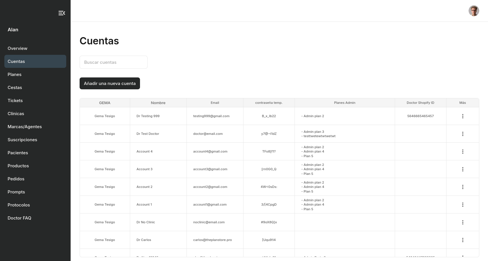
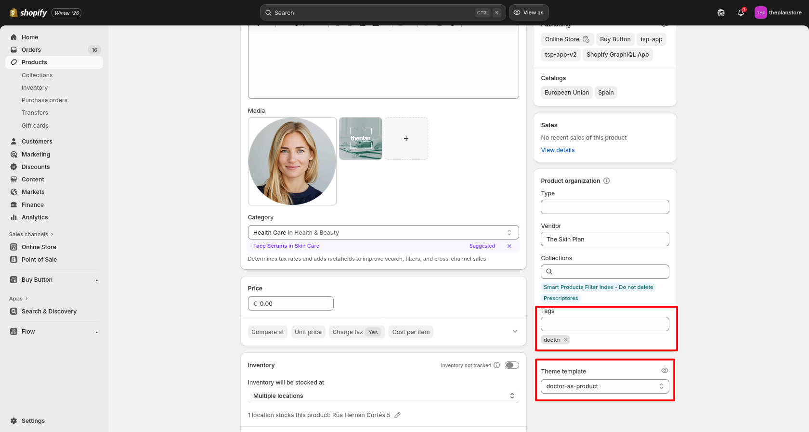
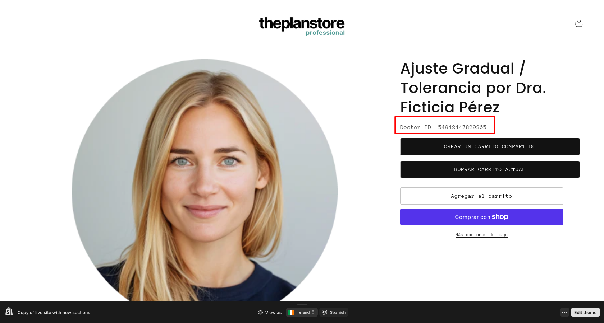

# Admin

## Iniciar sesión como usuario admin

## Overview

### Un resumen de los últimos datos

1. Cuentas
2. Pacientes
3. Cestas
4. Planes
5. Pedidos
6. Productos

## Cuentas

### Crear una nueva cuenta de usuario para una doctora / clínica

Cree una cuenta para un doctor o clínica. Esto generará una contraseña temporal para el nuevo usuario. Esta contraseña temporal no se puede actualizar. Los datos de inicio de sesión del nuevo usuario serán la dirección de correo electrónico utilizada para crear la cuenta y la contraseña temporal generada automáticamente.

| Nombre | Descripción |
| ----------- | ----------- |
| Nombre del doctor ( entrar "el" o "la") | Nombre de la doctora / clínica. Introduzca 'el' o 'la' para identificar el género de la doctora |
| Tipo de usuario | Tipo de usuario Doctor/Clínica: para crear un usuario administrador, seleccione "Admin", para mostrar la opción "Protocolos" en el menú de la página de inicio del Doctor, seleccione "Protocolo".|
| Doctor email | Doctor/Clinic email - Este será el nombre de usuario del doctor |
| Doctor/Clínica tel | Número de teléfono del doctor/clínica. Este número se utilizará para enviar mensajes SMS al paciente|
| Asignar planes admin a la doctora | Seleccione "Planes" creados en [Planes](/admin/#planes): estos planes aparecerán en la página de inicio del Doctor en "Mis Planes". |
| Marca | Añadir marca a un médico/clínica. Crea la marca en [Marcas/Agentes](/admin/#admin/#marcasagentes) |
| Agente | Listado de agentes asociados a la marca seleccionada. Crea la agente en [Marcas/Agentes](/admin/#admin/#marcasagentes) |
| Asignar planes de marca a la doctora | Seleccione "Planes" asignados a una marca, creados en [Planes](/admin/#planes): estos planes aparecerán en la página de inicio del Doctor en "Mis Planes". |
| Asignar cestas favoritas a la doctora | Seleccione "Cestas" creadas en [Cestas](/admin/#cestas): estos cestas en la página de inicio del Doctor en "Mis Cestas -> Favoritas" y "Nueva Cesta -> Tus cestas favoritas"|
| ID doctor de Shopify | Cada doctor/clínica se añade como producto a los productos de Shopify. Esto crea un ID de variante de producto para el doctor. Este ID se utiliza en los enlaces de la cesta. Sin el ID, los datos del doctor no aparecerán en la página de la cesta de Shopify. |
| Página de colección de productos de Shopify | URL de colección de productos de Shopify |
| Gema | Seleccione el tipo de GEMA - Gema Tesigo o No Gema |
| Identificador único del doctor |  Un código único para identificar a la doctora en planes. |
| Stripe | Seleccione el plan de suscripción de Stripe (no se utiliza actualmente, se puede dejar vacío) |
| Clínica | Seleccione una clínica principal. Esto se utiliza si hay una clínica con varios doctores. Cada docotr tiene una cuenta, pero se le asigna una clínica principal. Crear las Clínicas en [Clínicas](/admin/#clinicas)  |

### Otras opciones

- Editar cuenta - Actualizar los detalles de la cuenta.
- Copiar cuenta - Crear cuentas duplicadas de una cuenta existente. Las cuentas tendrán la misma configuración, excepto el nombre del médico, el correo electrónico, el teléfono, el ID de Shopify y la contraseña temporal.
- Cambiar email de la cuenta - Cambiar el correo electrónico del usuario
- Eliminar cuenta

## Planes

## Cestas

## Clínicas

## Marcas/Agentes

## Suscripciones

## Pacientes

## Productos

## Pedidos

## Prompts

## Protocolos

## Doctor FAQ

