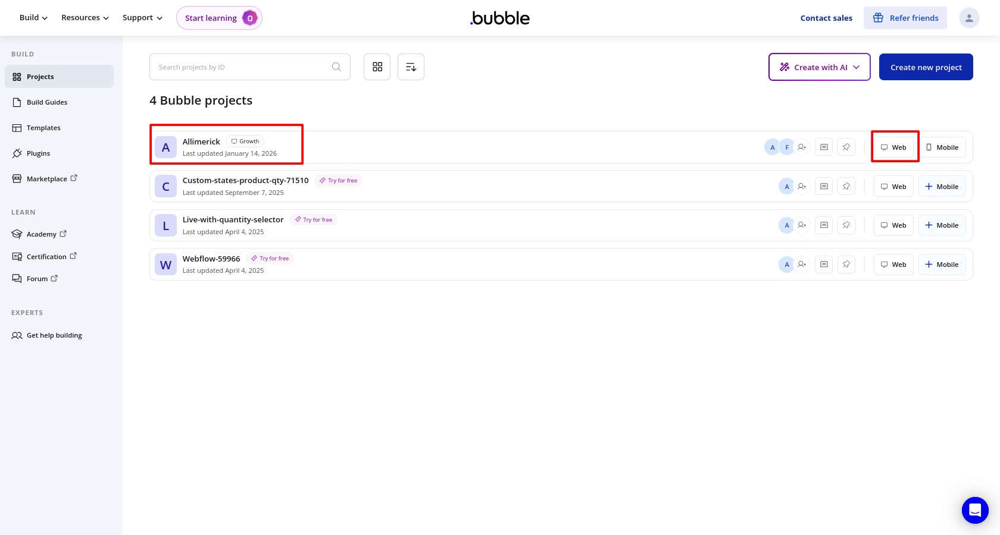
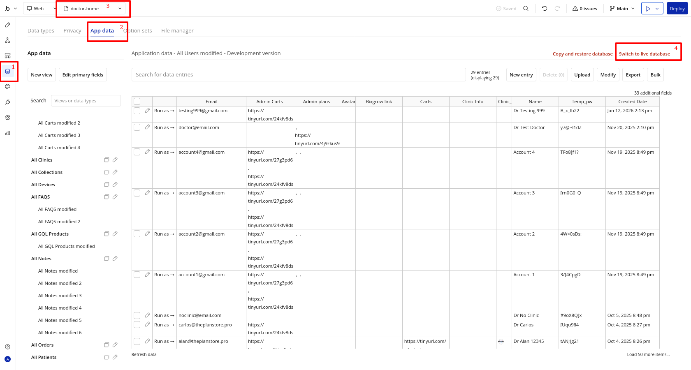
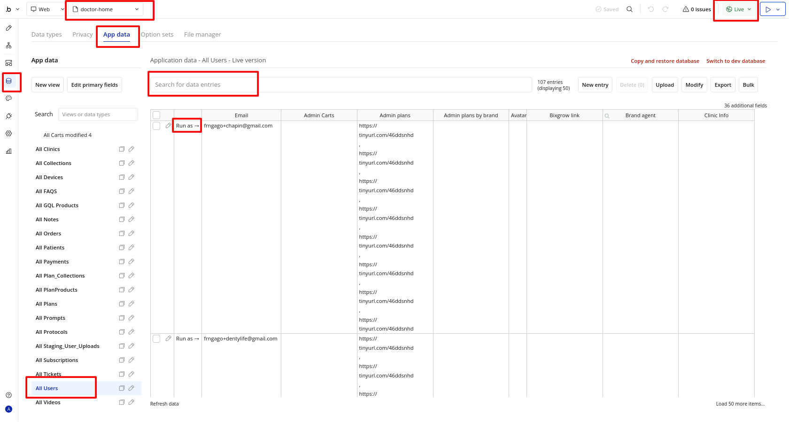

# Iniciar sesión en una cuenta de usuario desde Bubble.io

- Vaya a https://bubble.io

- Iniciar sesión con el correo electrónico y la contraseña de la cuenta

- Seleccione la versión "Web" de la aplicación

- Seleccione el botón "Data" del menú del lado izquierdo

- Cambiar a la base de datos en vivo (para comenzar estará en la base de datos de desarrollo)
- Seleccione "doctor-home" de la lista de páginas
- Seleccione la vista "App data"

- Seleccione la tabla de base de datos "All Users": esto mostrará todas las cuentas de usuarios
- Busque a tu usuario / doctor
- Seleccione "Run as ->" 

Ahora iniciará sesión como usuario y será llevado a la página de inicio del Doctor.

